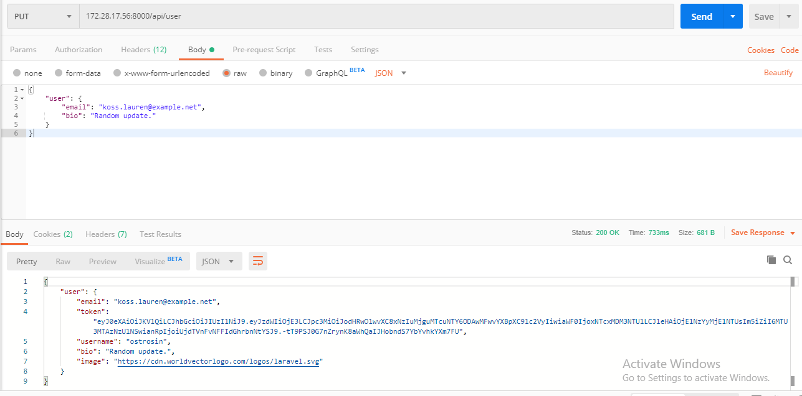
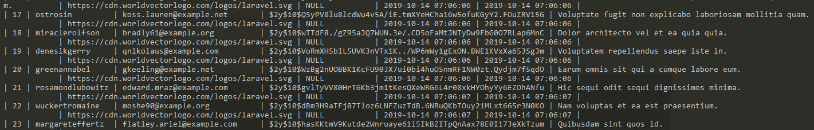

# Dokumentasi ETS BDT

## Tujuan

*Deployment* untuk sistem basis data terdistribusi menggunakan metode replikasi grup. Replikasi akan menggunakan tiga server basis data, satu *load balancer*, dan satu *server web*. 

## Desain Infrastruktur

Secara umum, desain dari infrastruktur seperti berikut.


### Web Server

Web server yang akan digunakan adalah `apache2` untuk meladeni program yang ditulis dengan bahasa pemrograman `PHP`. Aplikasi yang akan digunakan adalah aplikasi (realworld)[https://github.com/gothinkster/realworld]. Pada bagian *backend* akan menggunakan *framework* Laravel.

### Load Balancer

Pembagi beban atau *load balancer* akan menggunakan HAProxy. Proxy akan didesain sedemikian hingga akan dibuat untuk *listen* dua port, satu untuk statistik dan satunya untuk koneksi database. Konfigurasi diatur di `/etc/haproxy/haproxy.cfg`. 


### Database Server

Peladen basis data akan menggunakan MySQL dengan skema replikasi grup.

### Vagrant

*Provisioning* akan dibantu menggunakan perangkat lunak Vagrant. Vagrant akan membangun mesin virtual *(vm)* sesuai dengan konfigurasi yang ada di `Vagrantfile`. Dalam kasus ini, *box* yang akan digunakan adalah `bento/ubuntu-16.04`.


## Implementasi

### Database Server

Sebelumnya, kita perlu UUID yang digunakan untuk *group id* dari kluster server database kita. Untuk mendapatkannya dapat dilakukan dengan perintah `uuidgen`. Secara umum, cara deployment dari database server ini mirip dengan tutorial sebelumnya.

### Load Balancer

Konfigurasi umum untuk proxy ini seperti waktu timeout default dan lain sebagainya diatur sebagai berikut.

```
global
    log 127.0.0.1 local0 notice
    user haproxy
    group haproxy

defaults
    log global
    retries 2
    timeout connect 3000
    timeout server 5000
    timeout client 5000
```

Konfigurasi untuk tampilan statistik dari node yang termanage seperti berikut.

```
listen stats # Define a listen section called "stats"
    bind :9201 
    mode http
    stats enable  
    stats hide-version  
    stats realm Haproxy\ Statistics 
    stats uri /  
    stats auth Username:Password  
```

Sedangkan untuk koneksi ke database, konfigurasinya sebagai berikut.

```
listen mysql-cluster
    bind :3306
    mode tcp
    balance roundrobin
    server mysql-1 172.28.17.53:3306 check
    server mysql-2 172.28.17.54:3306 check
    server mysql-3 172.28.17.55:3306 check
```

Konfigurasi tersebut disimpan di  `/etc/haproxy/haproxy.cfg`.

Setelahnya, dasbor statistik HAProxy bisa diakses di `172.28.17.52:9021`. Untuk tampilan statistik dari HAProxy sendiri akan seperti berikut.


### Web Server

Aplikasi yang digunakan adalah (laravel-realworld-example-app)[https://github.com/gothinkster/laravel-realworld-example-app], untuk deployment sudah cukup dijelaskan. Namun secara umum, perintah yang harus kita lakukan adalah mengganti *environment variable* di `.env`, instalasi *package* yang dibutuhkan, generasi key untuk aplikasi dan JWT, migrasi database, dan *database seeding*.

Untuk `.env` dalam kasus ini diubah seperti di bawah. 

```env
APP_ENV=production

DB_HOST=172.28.17.52
DB_DATABASE=realworld
DB_USERNAME=haproxy_root
DB_PASSWORD=admin
```

Untuk instalasi paket bisa dilakukan dengan *composer*.

```bash
composer install
```

Kemudian melakukan generasi kunci untuk aplikasi dan JWT untuk autentikasi bisa dilakukan dengan perintah dibawah.

```sh
sudo php artisan key:generate
sudo php artisan jwt:generate
```

Setelahnya dapat dilakukan migrasi dan *database seeding*.

```sh
sudo php artisan migrate
sudo php artisan db:seed
```


#### Pengujian Web Server

Karena aplikasi yang dipakai merupakan *backend* saja yang akan merespon dari suatu *request* menjadi JSON data, pengujian akan dilakukan dengan bantuan aplikasi *Postman*. Untuk pengujian pertama, kita melakukan login untuk user yang sudah terseed sebelumnya. Proses, URL, metode, dan hasil dari *request* tersebut dapat dilihat seperti di bawah.


Di sini kita akan mendapatkan token autentikasi JWT yang nantinya dapat digunakan untuk akses endpoint tertentu, salah satu contohnya adalah untuk update data dari user sendiri.



Sehingga isi dari data berikut.


Nantinya akan berubah menjadi data berikut.


Selain itu, karena kita menggunakan proxy sebagai load balancer basis data kita, request masih akan tetap dapat diladeni jika salah satu node db mati.


