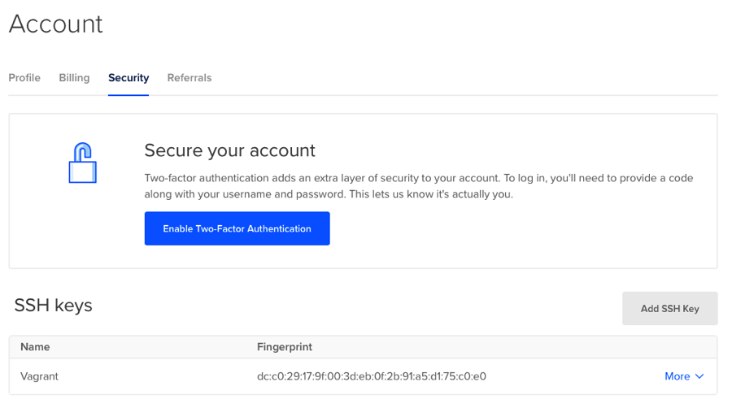
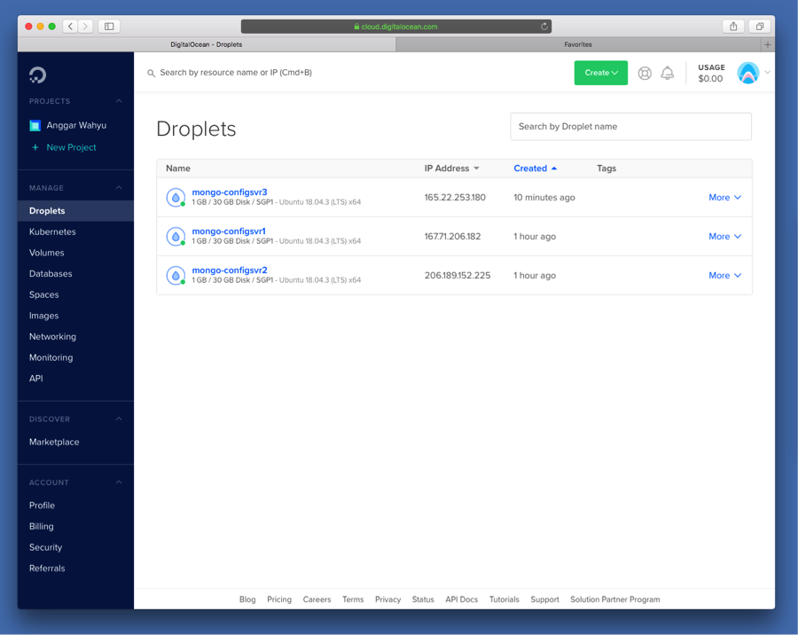

# Dokumentasi

## Setup

Aplikasi berbentuk API yang akan diuji ada di http://github.com/anggar/usda.fdc 

Untuk datasetnya sendiri, saya akan menggunakan dataset FoodCentral dari United State Department of Agriculture. Dataset berupa berkas tabular csv yang terpisah menjadi beberapa berkas. *Collection* yang akan digunakan adalah food, food_nutrient, dan nutrient, yang masing-masing berasal dari berkas csv sesuai namanya.

Setup akan menggunakan droplet pada DigitalOcean, oleh karena itu konfigurasi pada `Vagrantfile` akan berbeda. Selain menggunakan platform DigitalOcean, akan menggunakan juga deployment secara lokal. 

### Setup DigitalOcean

Sebelumnya untuk deployment yang menggunakan DigitalOcean harus menginstall terlebih dahulu plugin *DigitalOcean* pada Vagrant yang dapatt dilakukan dengan cara

```bash
vagrant plugin install vagrant-digitalocean
```

Agar memudahkan pengaksesan, sebaiknya kita generasi key SSH yang nantinya akan didaftarkan pada Dashboard Account di DigitalOcean. Cara generasi kuncinya sendiri seperti berikut:

```bash
ssh-keygen -t rsa
```

Nantinya, pindahkan kedua kunci tersebut ke folder root vagrant yang nantinya akan . Selain itu, tambahkan kunci publik ke dalam daftar kunci SSH di Dashboard Account pada DigitalOcean dengan nama `Vagrant`.



Kemudian untuk konfigurasi masing-masing vm akan menjadi seperti ini

```ruby
config.vm.define "mongo-configsvr1" do |droplet|
  droplet.vm.provider :digital_ocean do |provider, override|
    override.ssh.private_key_path = PRIVATE_KEY_PATH
    override.vm.box = 'digital_ocean'
    override.vm.box_url = DO_BOX_URL
    override.nfs.functional = false
    override.vm.allowed_synced_folder_types = :rsync
    provider.token = TOKEN
    provider.image = 'ubuntu-18-04-x64'
    provider.region = 'sgp1'
    provider.size = '1gb'
    provider.private_networking = true
  end
end
```

Hal yang perlu diperhatikan dari konfigurasi di atas adalah kita harus menghidupkan *private networking* pada droplet, mengingat nantinya antar droplet akan berkomunikasi satu sama lain.

Sedangkan untuk *environment variable* yang dipakai pada konfigurasi berupa

```ruby
DO_BOX_URL = "https://github.com/devopsgroup-io/vagrant-digitalocean/raw/master/box/digital_ocean.box"
PRIVATE_KEY_PATH = "./id_rsa"
TOKEN = ENV['DO_TOKEN']
```

Variable `DO_TOKEN` merupakan token yang didapatkan melalui dashboard DigitalOcean bagian API.

 

Lakukan deployment dengan menggunakan perintah `vagrant up` kemudian diharapkan akan menghasilkan droplet di Dashboard DigitalOcean.



### Setup Lokal

Setup dapat dilakukan dengan cukup menggunakan perintah
```sh
vagrant up --provider virtualbox
```

Dalam hal ini kita perlu memberikan detail provider yang digunakan, mengingat di berkas `Vagrantfile` ada dua provider. Selain itu, hal yang perlu diperhatikan pastikan bahwa kita hanya memilih satu provider, jika sebelumnya telah mendeploy ke DigitalOcean, droplet tersebut haruslah dihapus.

## Detail Aplikasi

Aplikasi yang digunakan berbentuk REST API, di mana user akan mengambil data dengan melakukan HTTP request ke alamat website tersebut, dalam hal ini pada *localhost*. Dalam pengembangannya aplikasi menggunakan framework Spring Boot dengan bahasa pemrograman Kotlin.

## Referensi

https://www.linode.com/docs/databases/mongodb/build-database-clusters-with-mongodb/