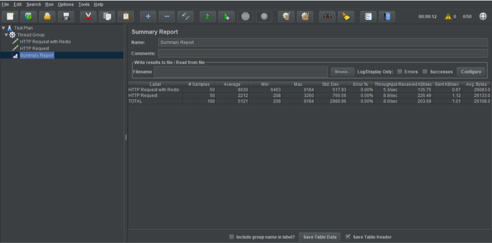

# Redis Documentation

>Anggar Wahyu Nur Wibowo
>05111740000052

## Setup

The overall design of the system will be as follow


| Cluster             | Hostname     | IP Address   | Box                  | RAM Allocation |
| ---------------     | ------------ | -------------| -------------------- | ---------------|
| Database            | db           | 172.28.17.52 | bento/ubuntu-18.04   | 1024 MB        |
| Redis 1 (Master)    | redis1       | 172.28.17.53 | bento/ubuntu-18.04   | 512 MB         |
| Redis 2 (Slave)     | redis2       | 172.28.17.54 | bento/ubuntu-18.04   | 512 MB         |
| Redis 3 (Slave)     | redis3       | 172.28.17.55 | bento/ubuntu-18.04   | 512 MB         |
| Wordpress 1         | webserver1   | 172.28.17.56 | bento/ubuntu-18.04   | 512 MB         |
| Wordpress 2         | webserver2   | 172.28.17.57 | bento/ubuntu-18.04   | 512 MB         |

### Redis Cluster

The clustering mechanism that will be used is Redis Sentinel as its provide automatic failover between nodes. 

The redis package will be installed by compilling from the source.

```sh
apt-get install -y gcc build-essential tcl libjemalloc-dev
curl -O http://download.redis.io/redis-stable.tar.gz
tar xzvf redis-stable.tar.gz
cd redis-stable
make distclean
make test
make install
```

We also need to enable the 6379 and 26379 port for communication with external source.

```sh
ufw allow 6379
ufw allow 26379
```

The redis configuration will be as follow

```conf
# redis.conf
bind 127.0.0.1
port 6379

protected-mode no
```

```conf
# redis-sentinel.conf
bind 127.0.0.1
port 26379

sentinel monitor redis-cluster 127.0.0.2 6379 2
sentinel down-after-milliseconds redis-cluster 5000
sentinel parallel-syncs redis-cluster 1
sentinel failover-timeout redis-cluster 10000

protected-mode no
```

The respective 127.0.0.1 and 127.0.0.2 will be replaced with IP address and master IP address for that node while provisioning.

We could run the redis instances by executing following command in each node

```sh
redis-server /etc/redis.conf &
redis-sentinel /etc/redis-sentinel.conf &
```

Then we could ensure the replication have been setup properly by checking using `info replication` command in redis-cli.


### Database Setup

We'll setup one MySQL instance for database. For installation we need to download it first from the source. The procedure for installation will be as follows

```bash
# Install required library
sudo apt-get install libaio1
sudo apt-get install libmecab2

# Get MySQL binaries
curl -OL https://dev.mysql.com/get/Downloads/MySQL-5.7/mysql-common_5.7.23-1ubuntu16.04_amd64.deb
curl -OL https://dev.mysql.com/get/Downloads/MySQL-5.7/mysql-community-client_5.7.23-1ubuntu16.04_amd64.deb
curl -OL https://dev.mysql.com/get/Downloads/MySQL-5.7/mysql-client_5.7.23-1ubuntu16.04_amd64.deb
curl -OL https://dev.mysql.com/get/Downloads/MySQL-5.7/mysql-community-server_5.7.23-1ubuntu16.04_amd64.deb

# Setting input for installation
sudo debconf-set-selections <<< 'mysql-community-server mysql-community-server/root-pass password admin'
sudo debconf-set-selections <<< 'mysql-community-server mysql-community-server/re-root-pass password admin'

# Install MySQL Community Server
sudo dpkg -i mysql-common_5.7.23-1ubuntu16.04_amd64.deb
sudo dpkg -i mysql-community-client_5.7.23-1ubuntu16.04_amd64.deb
sudo dpkg -i mysql-client_5.7.23-1ubuntu16.04_amd64.deb
sudo dpkg -i mysql-community-server_5.7.23-1ubuntu16.04_amd64.deb
```

We need to enable the port 3306 and 33061 for communication with external source. Beside that, we also need to disable the default localhost binding in `mysqld.cnf` in order to make node reachable from outer source.

```sh
ufw allow 33061
ufw allow 3306
```

```cnf
# mysqld.cnf
# bind-address  = 127.0.0.1
```

The final step is iniating the database and user that will be used for the wordpress. We could do that by executing following lines in MySQL CLI interface.

```sql
CREATE DATABASE wordpress DEFAULT CHARACTER SET utf8 COLLATE utf8_unicode_ci;
GRANT ALL PRIVILEGES ON *.* TO 'root'@'%';
GRANT ALL ON wordpress.* TO 'wordpressuser'@'%' IDENTIFIED BY 'password';
FLUSH PRIVILEGES;
```

### Wordpress Installation

Both wordpress instances will be installed respectively in webserver1 and webserver2. The installation procedure will follow the reference<sup>[1](https://www.digitalocean.com/community/tutorials/how-to-install-wordpress-with-lamp-on-ubuntu-18-04)</sup>. The difference between them is webserver1 will be using Redis as a cache mediator to database instance, hence hopefully will result in better performance. Wordpress installation in webserver1 will be using redis-cache plugin to help achieving caching functionality.

Redis configuration in webserver1 could be represented by adding following lines to `wp-config.php` in wordpress installation folder.

```php
define( 'WP_REDIS_CLIENT', 'predis' );
define( 'WP_REDIS_SENTINEL', 'redis-cluster' );
define( 'WP_REDIS_SERVERS', [
    'tcp://172.28.17.53:26379',
    'tcp://172.28.17.54:26379',
    'tcp://172.28.17.55:26379',
] );
```

And then we need to install Redis Object Cache plugin for wordpress and enable the plugin through dashboard.


## Testing

### Failover 

For failover we could sleep the master instance, and wait for other node to check the availability.

```sh
redis-cli -h 172.28.17.53 DEBUG sleep 60
```

The result, the master node will be moved to redis2 instance


### Load Testing

We'll use JMeter as tool to load testing the webserver capability. The result will be as follows




We can see that when requesting the respective address the throughput for cached wordpress instance is smaller than non-cached instance.

## References

1. https://www.digitalocean.com/community/tutorials/how-to-install-wordpress-with-lamp-on-ubuntu-18-04
2. https://scalegrid.io/blog/using-redis-object-cache-to-speed-up-your-wordpress-installation/
3. https://www.linode.com/docs/databases/mongodb/build-database-clusters-with-mongodb/
4. https://www.digitalocean.com/community/tutorials/how-to-use-apache-jmeter-to-perform-load-testing-on-a-web-server
